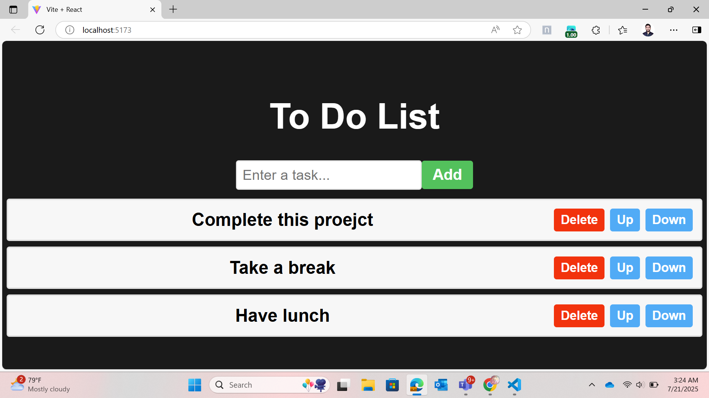

# 📝 To-Do List using ReactJS

A simple and interactive to-do list app built using **ReactJS**. It allows users to add, delete, and reorder tasks easily through a clean interface.

## 🚀 Features

- ✅ Add new tasks  
- ❌ Delete tasks  
- 🔼 Move tasks up  
- 🔽 Move tasks down  
- ⚛️ Built using React Hooks (`useState`)

## 🛠️ Tech Stack

- ReactJS  
- JavaScript (ES6)  
- HTML & CSS

## 📸 Demo Screenshot



## 📁 Folder Structure
src/  
├── App.jsx  
├── ToDoList.jsx  
├── index.js  
└── styles.css  

## ▶️ Getting Started

1. **Clone the repository:**
   ```bash
   git clone https://github.com/inmate22/react-todo-list.git
   cd react-todo-list
2. **Install dependencies:**
   ```bash
   npm install
3. **Run the development server:**
   ```bash
   npm start
## 🙌 Contributions
Feel free to fork this repo, create a feature branch, and open a pull request with improvements!
## Important
This project follows this [BroCode tutorial](https://www.youtube.com/watch?v=9wiWzu_tRB0).
